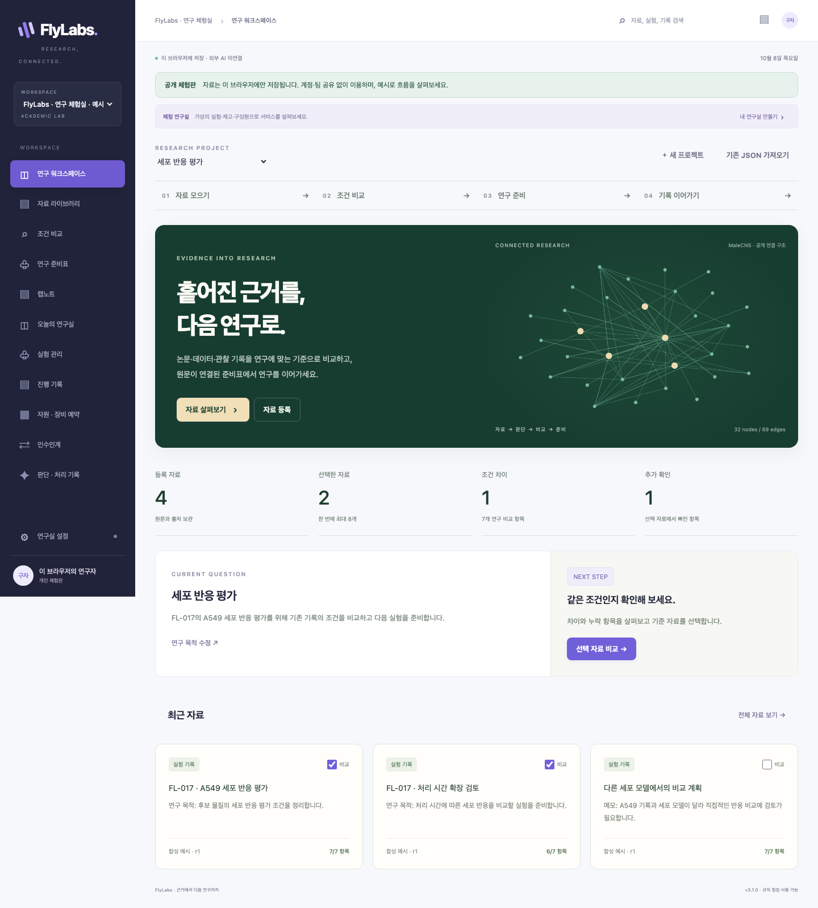

# FlyLabs v3.1.0

**흩어진 연구 자료를 비교하고, 근거가 연결된 준비표와 연구노트로 이어가는 연구 워크스페이스.**

공개 체험판: https://flylabs-research.vercel.app

GitHub: https://github.com/AwesomeZun/FlyLabs



## 해결하려는 문제

연구자는 논문, 실험 기록, 데이터 파일과 회의 메모를 오가며 다음 연구를 준비합니다. 자료마다 조건과 표현이 달라 무엇을 같은 기준으로 비교할 수 있는지 확인해야 하고, 빠진 정보를 찾은 뒤 준비 과정과 실제 수행 결과를 다시 기록해야 합니다. 전담 개발자나 분석 인력이 없는 팀에는 AI 도구를 선택하고 연결하는 과정도 부담입니다.

FlyLabs는 익숙한 자료와 연구 질문으로 시작해 **자료 등록 → 조건 비교 → 원문 확인 → 준비표 → 연구노트**를 하나의 흐름으로 연결합니다. 생명과학 실험뿐 아니라 계산·데이터 분석, 정량 연구, 인터뷰·관찰, 문헌·이론 연구와 직접 정의한 비교 항목을 지원합니다. 모든 연구의 과학적 판단을 자동화한다는 의미는 아닙니다.

최신 AI를 활용하면서 미공개 연구데이터를 어디까지 제공할지 통제하는 것도 핵심 개발 방향입니다. 아래 표에서 현재 구현한 기능과 앞으로 개발할 기능을 구분합니다.

## 현재 제공하는 두 실행 방식

| 항목 | 공개 브라우저 체험판 | 연구실 서버용 시제품 |
|---|---|---|
| 저장 | 현재 브라우저의 IndexedDB | 연구실 서버의 SQLite와 첨부 파일 |
| 자료·조건 비교 | 명시된 항목과 단위의 로컬 규칙 비교 | 동일한 비교 + 설정 시 AI 판단·추출 |
| 준비표·노트 | 원문 스냅샷, 수정 이력, 계획·관찰·해석 분리 | 동일한 기록 기능 |
| 첨부 | 브라우저에 원본 저장·다운로드 | 서버에 원본 저장·다운로드 |
| 계정·협업 | 없음, 개인 체험용 | 로그인, 초대, 관리자·편집·열람 권한 |
| 외부 AI | 연결하지 않음 | Jev 판단, Gemini 초안·조건 추출 |
| 기록 잠금 | 인증 없는 확인 기록과 편집 잠금 | 계정에 연결된 서명과 편집 잠금 |
| OpenShell 샌드박스 | 미구현 | 개발 계획 |

### 공개 체험판에서 해보기

1. ‘자료 프로젝트’에서 생명과학·문서 분류·인터뷰·문헌 연구 예시를 선택합니다. 기본 자료는 모두 합성 예시입니다.
2. 자료를 선택하고 ‘조건 비교’에서 차이와 누락을 확인합니다. 값을 누르면 해당 원문 줄을 볼 수 있습니다.
3. ‘연구 준비표’에서 기준 자료와 확인할 조건을 정하고 ‘저장 후 랩노트 시작’을 누릅니다.
4. 계획, 실제 수행, 관찰 결과, 해석을 나누어 기록합니다. 원문·수정 이력과 첨부 파일을 함께 보관합니다.
5. 노트는 Markdown, 전체 기록과 첨부 원본은 설정 화면에서 JSON으로 내보냅니다.

브라우저 데이터를 삭제하면 체험판 기록도 지워집니다. 다른 기기와 동기화되지 않으며 계정 인증도 없습니다. 전체 JSON 백업의 일괄 복원 화면은 아직 제공하지 않습니다. ‘기존 JSON 가져오기’는 원래 v1.1.0 자료 백업 형식을 지원합니다.

## AI와 연결 지도 활용

- **Jev 판단:** 서버용 시제품에서 선택한 자료의 연구 목적 관련성·맥락과 진행 메모를 판단합니다. 상태 변경은 제안으로 보관하며 연구자가 검토해 반영합니다.
- **Gemini 초안:** 선택한 원문·노트·텍스트 파일로 검토 가능한 초안을 만듭니다. 조건 추출은 값·인용문·원문 줄을 확인하고, 사용자가 선택한 항목을 반영합니다.
- **초파리 연결 지도(connectome):** 공개 MaleCNS 데이터의 32개 뉴런·69개 연결을 처리 순서 실험에 활용합니다. 필수 작업의 선후관계를 유지하며 일반 순서와 비교할 수 있습니다. 연구 정확도나 성공률이 높아졌다는 성능 증거는 아직 없습니다.

공개 체험판은 외부 AI 없이 규칙으로 작동합니다. 서술형 문장의 의미 전체를 이해하거나 실험 조건의 과학적 타당성을 검증하지 않습니다.

## 연구데이터 보호와 개발 계획

공개 체험판은 등록한 자료를 서버나 외부 모델에 보내지 않습니다. 배포 설정의 Content Security Policy는 `connect-src 'none'`으로 네트워크 연결을 차단합니다. 브라우저 저장 자체가 암호화, 계정별 보호 또는 보안 인증을 의미하지는 않습니다.

서버용 AI 기능은 **사용자가 선택한 내용**을 외부 제공자에게 전송합니다. 기관의 데이터 이용 기준에 맞는 자료로 사용해야 합니다.

향후에는 원자료를 연구실 내부에 보관하고, 승인한 최소 정보만 외부 모델에 제공하며, 분석 코드를 파일·네트워크 권한이 제한된 환경에서 실행하는 구조를 개발합니다. 출력·오류 메시지·로그의 외부 전송 검토도 포함합니다. OpenShell 기반 실행 격리와 GPT·Claude 연동은 이 릴리스의 완성된 기능이 아닙니다.

## 로컬 실행

Node.js 22.16 이상이 필요합니다. API 키 없이도 규칙 비교와 직접 기록 기능을 사용할 수 있습니다.

```sh
npm ci
npm run dev
```

웹 화면은 http://127.0.0.1:4210, API는 http://127.0.0.1:4211입니다. 기본 바인딩은 로컬 컴퓨터입니다. 서버용 시제품은 회원가입 화면에서 계정을 생성합니다. 기본 비밀번호는 제공하지 않습니다.

서버용 빌드:

```sh
cp .env.example .env
# 필요한 경우 .env에 제공자 키를 직접 설정합니다.
npm run build
npm start
```

http://127.0.0.1:4211 에서 사용합니다. `.env`, `.data`, 백업과 실제 연구자료는 Git에 포함하지 않습니다. 데이터 디렉터리마다 서버 프로세스 하나를 사용합니다. 외부 서버 운영 시 HTTPS 프록시와 `PUBLIC_ORIGIN`을 함께 설정합니다.

공개 체험판과 같은 브라우저용 빌드:

```sh
npm run build:demo
python3 -m http.server 4220 --bind 127.0.0.1 --directory dist
```

http://127.0.0.1:4220 에서 사용합니다. `build`와 `build:demo`는 모두 `dist`를 생성하므로 원하는 방식을 선택해 다시 빌드합니다. 루트 `vercel.json`은 브라우저 체험판을 빌드하도록 설정되어 있습니다. SQLite 서버용 앱을 정적 배포만으로 운영할 수는 없습니다.

## 검증

v3.1.0에서 확인한 결과:

| 검사 | 결과 |
|---|---|
| 도메인·서버 자동 테스트 | 27개 통과 |
| 서버 브라우저 시나리오 | 17개 통과, AI 응답은 시뮬레이션 |
| 로컬 공개 체험판 시나리오 | 10개 통과 |
| 실제 공개 주소 시나리오 | 10개 통과 |

공개 주소 검증은 자료 비교, 다른 연구 유형, 준비표→노트, 새로고침 후 저장 유지, 첨부 바이트 보존, 백업, 수정 이력, 모바일 화면과 검사한 흐름에서 외부 요청·데이터 POST가 없음을 확인합니다. 제공자 모델의 과학적 정확도나 보안 인증을 입증하는 검사는 아닙니다.

```sh
npm test
npm run build
npx playwright install chromium
npm run qa
# 체험판 빌드와 4220 서버 실행 후:
npm run qa:demo
```

검증 기록: `docs/qa-report.json`, `docs/qa-demo-public.json`, `docs/deployment-v3.1.0.json`.

## 개발 경험과 실증 계획

강성준은 의과학 연구, 항체 신약개발, 단일세포·공간 데이터 분석, AI 활용 교육과 웹 서비스 개발 경험을 바탕으로 FlyLabs를 개발합니다. OpenShell 기반 보안 AI 에이전트와 신약개발·약물감시 CLI 설계 경험을 보안·분석 흐름에 적용할 계획입니다.

FlyGate와 K-BeautyGate로 NVIDIA 해커톤 Top 5 결승에 진출했으며, 결승전은 11월 NVIDIA 공식 행사에서 개최될 예정입니다. 이는 FlyLabs 자체의 수상 실적이 아닙니다.

하버드 의과대학·MGH의 노강산 박사와 Demehri 연구실의 임성하 박사후연구원과 협력하여 현장 요구사항을 확인하고 실증 테스트를 추진할 계획입니다. 현재 실증 완료나 기관 차원의 도입을 뜻하지 않습니다.

경력·저서: https://kangseongjun.com

FlyGate: https://flygate.kr

K-BeautyGate: https://k-beauty-gate-zeta.vercel.app/bunny

FlyBrain: https://flybrain.kr

FDDD: https://github.com/AwesomeZun/FDDD

노강산 연구자 소개: https://researchers.mgh.harvard.edu/profile/17639612/Kangsan-Roh

## 데이터 출처와 릴리스

MaleCNS v1.0 연결 데이터: FlyEM/HHMI Janelia, University of Cambridge, MRC LMB, Google Research. CC BY 4.0. 원본 주소·선택 방법·해시는 `data/connectome.json`에 보존되어 있습니다.

https://male-cns.janelia.org/download/

v3.1.0은 독립적으로 개발된 v1.1.0의 자료 비교·준비 흐름과 v2.0.0의 연구실 기록·협업 기능을 통합한 v3.0.0을 바탕으로 공개 체험판을 추가한 버전입니다. 버전 이름만으로 기존 두 제품이 같은 계보였다는 뜻은 아닙니다. 이전 README는 `docs/readme-history`에 보존했습니다.
